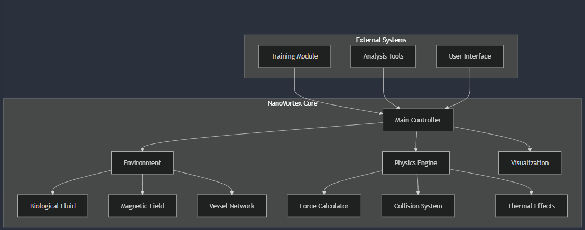
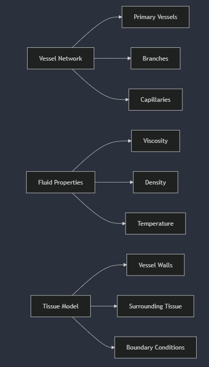
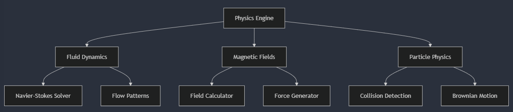
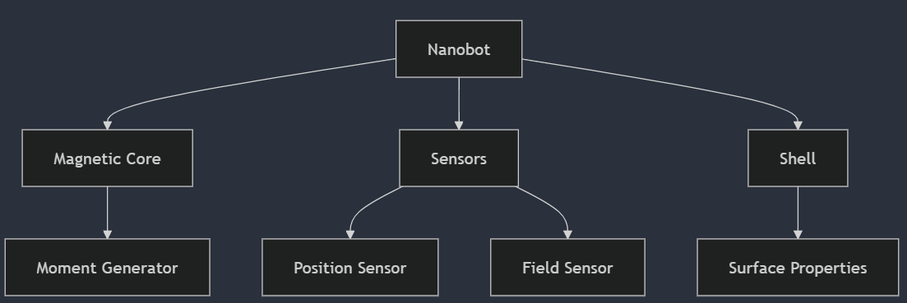
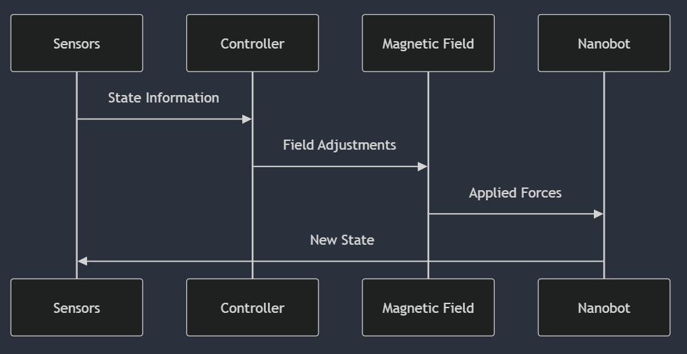
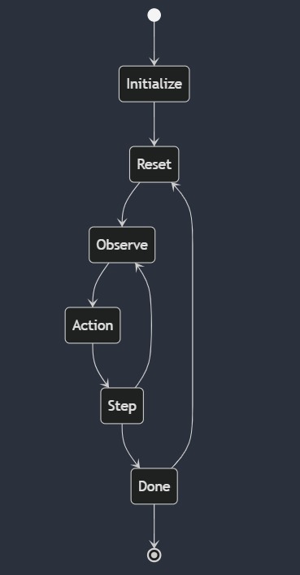

# NanoVortex: Advanced Magnetic Nanobot Simulation Framework


## 🌟 Overview
NanoVortex is a state-of-the-art physics-based simulation framework for magnetically-controlled nanobots in biomedical applications. It combines advanced fluid dynamics, precise magnetic field modeling, and reinforcement learning to develop and validate navigation strategies for next-generation medical procedures.

[Figure 1: NanoVortex System Architecture]

## 📚 Table of Contents
1. [Core Features](#core-features)
2. [System Architecture](#system-architecture)
3. [Physical Models](#physical-models)
4. [Installation](#installation)
5. [Usage Guide](#usage-guide)
6. [Technical Documentation](#technical-documentation)
7. [Development](#development)
8. [Contributing](#contributing)

## 🚀 Core Features

### Biological Environment Simulation
- **Vessel Modeling**: Anatomically accurate blood vessel networks
- **Fluid Dynamics**: Real-time blood flow simulation
- **Tissue Interaction**: Multi-layer tissue boundary modeling
- **Physical Properties**: Temperature, viscosity, and density variations


[Figure 2: Biological Environment Components]

### Advanced Physics Engine
| Component | Description | Implementation |
|-----------|-------------|----------------|
| Fluid Dynamics | Navier-Stokes equations for microscale flow | `biological_fluid.py` |
| Magnetic Fields | 3D electromagnetic field simulation | `magnetic_field.py` |
| Particle Physics | Brownian motion and collision detection | `physics/forces.py` |
| Thermal Effects | Temperature-dependent behavior modeling | `physics/thermodynamics.py` |


[Figure 3: Physics Engine Architecture]

### Nanobot Specifications
```python
NANOBOT_SPECS = {
    "diameter": "1mm",
    "mass": "1mg",
    "magnetic_moment": "1e-3 A·m²",
    "control_frequency": "240Hz",
    "sensor_types": ["position", "orientation", "field_strength"]
}
```

[Figure 4: Nanobot Component Diagram]

## 💡 System Architecture

### Core Components
1. **Environment Module**
   - Blood vessel network generation
   - Fluid dynamics simulation
   - Obstacle and boundary management

2. **Physics Engine**
   - Force calculations
   - Field propagation
   - Collision detection
   - Thermal interactions

3. **Control System**
   - Magnetic field optimization
   - Path planning
   - Real-time navigation
   - Swarm coordination


[Figure 5: Control System Flow]

### Key Parameters

#### Biological Parameters
| Parameter | Value | Unit | Description |
|-----------|-------|------|-------------|
| Blood Viscosity | 0.004 | Pa·s | Dynamic viscosity at body temperature |
| Blood Density | 1060 | kg/m³ | Standard blood density |
| Flow Velocity | 0.3 | m/s | Average arterial flow speed |
| Temperature | 310.15 | K | Normal body temperature |

#### Magnetic Control Parameters
| Parameter | Value | Unit | Description |
|-----------|-------|------|-------------|
| Field Strength | 0.1 | Tesla | Maximum applied field |
| Gradient | 2.0 | T/m | Field spatial variation |
| Update Rate | 240 | Hz | Control loop frequency |
| Precision | 10 | µm | Positioning accuracy |

[Figure 6: Parameter Relationships]

## 🔧 Installation

### Prerequisites
- Python 3.8+
- CUDA-capable GPU (recommended)
- 8GB+ RAM

### Setup Instructions
```bash
# Clone the repository
git clone https://github.com/MuhammadRamzy/nanovortex.git
cd nanovortex

# Create virtual environment
python -m venv venv
source venv/bin/activate  # Linux/Mac
# or
.\venv\Scripts\activate  # Windows

# Install dependencies
pip install -r requirements.txt
```

## To run the simulation:

#### 1. Make sure all the code files are in their correct directories according to the project structure.

#### 2. Run the diagnostics first:
```bash
python debug_utils.py
```

#### 3. If diagnostics pass, run the simulation:
```bash
python run_simulation.py
```


## 📊 Usage Guide

### Basic Simulation
```python
from nanovortex.environment import NanoVortexEnv
from nanovortex.agents import MagneticController

# Initialize environment
env = NanoVortexEnv(
    vessel_type="arterial",
    flow_model="pulsatile",
    difficulty="normal"
)

# Create controller
controller = MagneticController(
    control_mode="adaptive",
    field_strength=0.1  # Tesla
)

# Run simulation
observation = env.reset()
for step in range(1000):
    action = controller.compute_action(observation)
    observation, reward, done, info = env.step(action)
    
    if done:
        break
```

[Figure 7: Simulation Workflow]

### Visualization Tools
```python
from nanovortex.visualization import Visualizer

viz = Visualizer(mode="3D")
viz.plot_trajectory(env.get_history())
viz.show_field_lines()
viz.save_animation("navigation.gif")
```

[Figure 8: Visualization Examples]

## 📖 Technical Documentation

### State Space Definition
```python
STATE_SPACE = {
    "position": Box(low=-1, high=1, shape=(3,)),
    "velocity": Box(low=-2, high=2, shape=(3,)),
    "orientation": Box(low=-1, high=1, shape=(4,)),
    "field_readings": Box(low=-0.1, high=0.1, shape=(3,)),
    "wall_distance": Box(low=0, high=1, shape=(1,))
}
```

### Control Actions
```python
ACTION_SPACE = {
    "field_direction": Box(low=-1, high=1, shape=(3,)),
    "field_strength": Box(low=0, high=0.1, shape=(1,)),
    "gradient_control": Box(low=-2, high=2, shape=(3,))
}
```

[Figure 9: State-Action Space Mapping]

## 🛠️ Development

### Project Structure
```
nanovortex/
├── src/
│   ├── environment/    # Simulation environment
│   ├── physics/        # Physical models
│   ├── agents/         # Control systems
│   ├── training/       # Learning algorithms
│   └── utils/          # Helper functions
├── tests/              # Test suite
├── examples/           # Usage examples
└── docs/              # Documentation
```

### Development Guidelines
1. Follow PEP 8 style guide
2. Write unit tests for new features
3. Document using Google-style docstrings
4. Create feature branches for development

## 🤝 Contributing
We welcome contributions! Please see our [Contributing Guidelines](CONTRIBUTING.md) for details.

## 📄 License
NanoVortex is released under the MIT License. See [LICENSE](LICENSE) for details.


